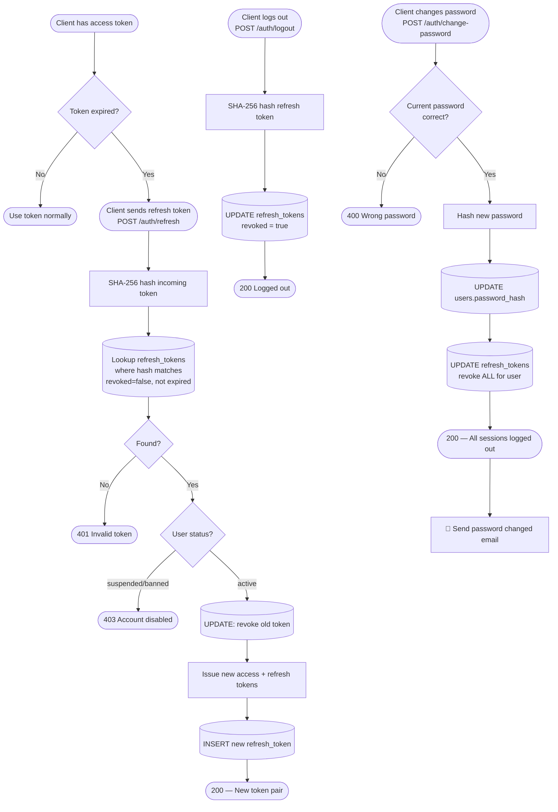
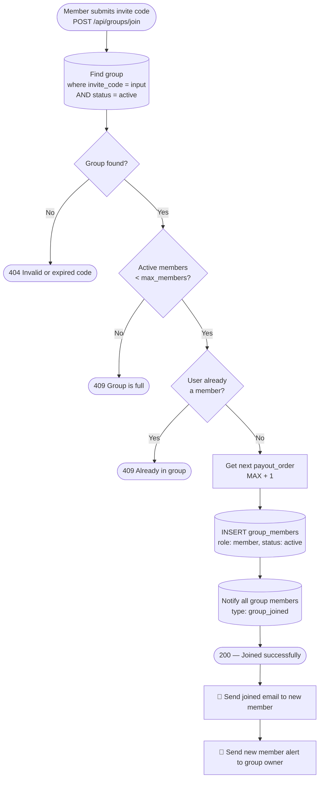
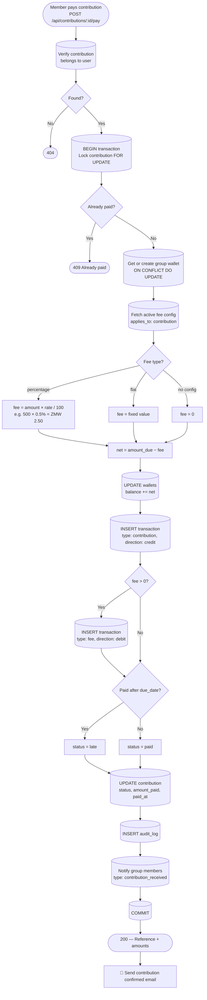
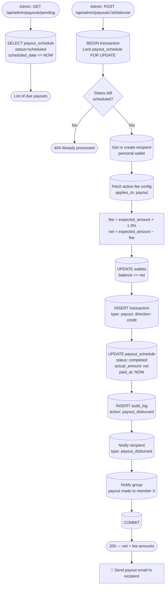

# Chilimba Platform — Technical Documentation

## Table of Contents

1. [Platform Overview](#1-platform-overview)
2. [Tech Stack](#2-tech-stack)
3. [Database Schema](#3-database-schema)
4. [Entity Relationships](#4-entity-relationships)
5. [User Flows](#5-user-flows)
   - 5.1 [Registration & Authentication](#51-registration--authentication)
   - 5.2 [Token Lifecycle](#52-token-lifecycle)
   - 5.3 [Group Creation](#53-group-creation)
   - 5.4 [Joining a Group](#54-joining-a-group)
   - 5.5 [Contribution Payment](#55-contribution-payment)
   - 5.6 [Withdrawal Request & Voting](#56-withdrawal-request--voting)
   - 5.7 [Payout Disbursement](#57-payout-disbursement)
   - 5.8 [Committee Pool (Crowdfunding)](#58-committee-pool-crowdfunding)
   - 5.9 [KYC Verification & Account Moderation](#59-kyc-verification--account-moderation)
   - 5.10 [File Upload](#510-file-upload)
6. [API Reference](#6-api-reference)
7. [Authentication & Authorization](#7-authentication--authorization)
8. [Platform Fees](#8-platform-fees)
9. [Email Notifications](#9-email-notifications)
10. [Error Handling](#10-error-handling)
11. [Database Views](#11-database-views)

---

## 1. Platform Overview

**Chilimba** is a digital village banking platform that digitises the traditional Zambian *chilimba* (rotating savings) system. Members form groups, contribute a fixed amount every month, and each member receives the total pooled amount on a rotating basis. The platform also supports voluntary crowdfunding campaigns (*committee pools*) for events like funerals, weddings, and emergencies.

### Core Concepts

| Concept | Description |
|---|---|
| **Group** | A rotating savings circle with a fixed monthly contribution and max member count |
| **Cycle** | One full rotation where every member has received a payout |
| **Round** | One monthly contribution period within a cycle |
| **Payout Schedule** | The pre-determined order in which members receive the pooled funds |
| **Committee Pool** | A voluntary crowdfunding campaign open to group members |
| **Wallet** | In-app balance ledger — each user has a personal wallet; each group has a group wallet |

---

## 2. Tech Stack

| Layer | Technology |
|---|---|
| Runtime | Node.js 20 |
| Framework | Express.js 4 |
| Database | PostgreSQL 15 (hosted on Supabase) |
| DB Client | `pg` (node-postgres) with connection pooling via pgBouncer |
| Auth | JWT (access) + opaque SHA-256-hashed refresh tokens |
| File Storage | Supabase Storage (bucket: `files`) |
| Email | Nodemailer (SMTP / Gmail App Password) |
| API Docs | Swagger UI (CDN-loaded) + OpenAPI 3.0.3 spec |
| Hosting | Vercel (serverless) |
| Security | Helmet, CORS, express-rate-limit |

---

## 3. Database Schema

### 3.1 Enums

```sql
user_role:        member | group_admin | admin | super_admin
user_status:      pending_verification | active | suspended | banned
id_type:          national_id | passport | drivers_license

group_status:     active | paused | completed | dissolved
group_member_role:  owner | admin | member
group_member_status: pending | active | removed | left

contribution_status: pending | paid | late | waived
payout_status:    scheduled | processing | completed | failed | skipped
withdrawal_status: pending_approval | approved | rejected | processing | completed | cancelled
approval_action:  approved | rejected
committee_status: active | closed | cancelled

transaction_type: contribution | payout | withdrawal | committee_contribution |
                  fee | refund | deposit | transfer
transaction_status: pending | completed | failed | reversed
wallet_type:      personal | group | committee

notification_type: contribution_reminder | contribution_received | payout_scheduled |
                   payout_disbursed | withdrawal_initiated | withdrawal_approved |
                   withdrawal_rejected | group_invite | group_joined | new_message |
                   committee_created | committee_contribution | system
```

---

### 3.2 `users`

Stores all registered users across all roles.

| Column | Type | Constraints | Description |
|---|---|---|---|
| `id` | UUID | PK, default `uuid_generate_v4()` | Primary key |
| `first_name` | VARCHAR(100) | NOT NULL | |
| `last_name` | VARCHAR(100) | NOT NULL | |
| `email` | VARCHAR(255) | UNIQUE, NOT NULL | Login identifier |
| `phone` | VARCHAR(20) | UNIQUE, NOT NULL | |
| `password_hash` | TEXT | NOT NULL | bcrypt hash (12 rounds) |
| `role` | user_role | NOT NULL, default `member` | Access tier |
| `status` | user_status | NOT NULL, default `pending_verification` | Account state |
| `date_of_birth` | DATE | nullable | |
| `id_type` | id_type | nullable | KYC document type |
| `id_number` | VARCHAR(50) | nullable | KYC document number |
| `id_verified` | BOOLEAN | default `false` | Set to true by admin after KYC |
| `profile_photo_url` | TEXT | nullable | Supabase Storage public URL |
| `last_login_at` | TIMESTAMPTZ | nullable | Updated on each login |
| `created_at` | TIMESTAMPTZ | NOT NULL, default NOW() | |
| `updated_at` | TIMESTAMPTZ | NOT NULL, default NOW() | Auto-updated by trigger |

**Indexes:** `email`, `phone`, `status`

---

### 3.3 `refresh_tokens`

Stores hashed opaque refresh tokens. Rotated on every use.

| Column | Type | Constraints | Description |
|---|---|---|---|
| `id` | UUID | PK | |
| `user_id` | UUID | FK → users(id) CASCADE | |
| `token_hash` | TEXT | UNIQUE, NOT NULL | SHA-256 of raw token |
| `expires_at` | TIMESTAMPTZ | NOT NULL | 7 days from creation |
| `revoked` | BOOLEAN | default `false` | Set to true on use or logout |
| `created_at` | TIMESTAMPTZ | NOT NULL | |

---

### 3.4 `groups`

A Chilimba savings group.

| Column | Type | Constraints | Description |
|---|---|---|---|
| `id` | UUID | PK | |
| `name` | VARCHAR(150) | NOT NULL | Display name |
| `description` | TEXT | nullable | |
| `slug` | VARCHAR(100) | UNIQUE | URL-safe name + timestamp |
| `status` | group_status | NOT NULL, default `active` | |
| `monthly_amount` | NUMERIC(15,2) | NOT NULL | Fixed contribution per round |
| `currency` | CHAR(3) | NOT NULL, default `ZMW` | |
| `max_members` | INTEGER | NOT NULL, default 12 | |
| `current_cycle` | INTEGER | NOT NULL, default 1 | Incremented when cycle completes |
| `contribution_day` | INTEGER | 1–28 | Day of month contributions are due |
| `payout_day` | INTEGER | 1–28 | Day of month payouts are made |
| `min_approvals_withdrawal` | INTEGER | NOT NULL, default 2 | Votes needed to approve withdrawal |
| `allow_late_contributions` | BOOLEAN | default `true` | |
| `late_fee_amount` | NUMERIC(15,2) | default 0 | |
| `invite_code` | VARCHAR(10) | UNIQUE | 8-char hex code for joining |
| `invite_expires_at` | TIMESTAMPTZ | nullable | Optional expiry |
| `cover_photo_url` | TEXT | nullable | Supabase Storage public URL |
| `created_by` | UUID | FK → users(id) | Group founder |
| `created_at` | TIMESTAMPTZ | NOT NULL | |
| `updated_at` | TIMESTAMPTZ | NOT NULL | Auto-updated |

**Indexes:** `slug`, `invite_code`, `status`

---

### 3.5 `group_members`

Join table between users and groups. Tracks role, payout order, and membership state.

| Column | Type | Constraints | Description |
|---|---|---|---|
| `id` | UUID | PK | |
| `group_id` | UUID | FK → groups(id) CASCADE | |
| `user_id` | UUID | FK → users(id) CASCADE | |
| `role` | group_member_role | NOT NULL, default `member` | `owner` / `admin` / `member` |
| `status` | group_member_status | NOT NULL, default `pending` | |
| `payout_order` | INTEGER | nullable, UNIQUE per group | Position in rotation |
| `joined_at` | TIMESTAMPTZ | nullable | |
| `removed_at` | TIMESTAMPTZ | nullable | |
| `created_at` | TIMESTAMPTZ | NOT NULL | |
| `updated_at` | TIMESTAMPTZ | NOT NULL | |

**Unique:** `(group_id, user_id)`, `(group_id, payout_order)`

---

### 3.6 `payout_schedule`

One row per member per cycle — defines who receives the payout, when, and how much.

| Column | Type | Constraints | Description |
|---|---|---|---|
| `id` | UUID | PK | |
| `group_id` | UUID | FK → groups(id) CASCADE | |
| `user_id` | UUID | FK → users(id) | Recipient |
| `cycle_number` | INTEGER | NOT NULL | |
| `payout_order` | INTEGER | NOT NULL | Position in this cycle |
| `scheduled_date` | DATE | NOT NULL | Target disbursement date |
| `expected_amount` | NUMERIC(15,2) | NOT NULL | `monthly_amount × member_count` |
| `status` | payout_status | NOT NULL, default `scheduled` | |
| `actual_amount` | NUMERIC(15,2) | nullable | Net after fees |
| `paid_at` | TIMESTAMPTZ | nullable | |
| `notes` | TEXT | nullable | |

**Unique:** `(group_id, cycle_number, payout_order)`

---

### 3.7 `contributions`

One row per member per monthly round. Tracks what is owed and what has been paid.

| Column | Type | Constraints | Description |
|---|---|---|---|
| `id` | UUID | PK | |
| `group_id` | UUID | FK → groups(id) CASCADE | |
| `user_id` | UUID | FK → users(id) | Contributor |
| `cycle_number` | INTEGER | NOT NULL | |
| `round_number` | INTEGER | NOT NULL | Month within cycle |
| `amount_due` | NUMERIC(15,2) | NOT NULL | = group `monthly_amount` |
| `amount_paid` | NUMERIC(15,2) | NOT NULL, default 0 | |
| `status` | contribution_status | NOT NULL, default `pending` | |
| `due_date` | DATE | NOT NULL | Contribution day of the month |
| `paid_at` | TIMESTAMPTZ | nullable | |
| `late_fee_charged` | NUMERIC(15,2) | default 0 | |
| `reference` | VARCHAR(100) | UNIQUE | `CHI-{groupId}-{cycle}-{round}-{userId}` |

**Unique:** `(group_id, user_id, cycle_number, round_number)`

---

### 3.8 `wallets`

Every user has one personal wallet. Every group has one group wallet. Balances are non-negative.

| Column | Type | Constraints | Description |
|---|---|---|---|
| `id` | UUID | PK | |
| `owner_id` | UUID | FK → users(id) CASCADE | |
| `type` | wallet_type | NOT NULL, default `personal` | |
| `group_id` | UUID | FK → groups(id) CASCADE, nullable | Set for group wallets |
| `balance` | NUMERIC(15,2) | NOT NULL, default 0, ≥ 0 | Current balance |
| `currency` | CHAR(3) | NOT NULL, default `ZMW` | |
| `is_frozen` | BOOLEAN | default `false` | |

**Unique:** `(owner_id, type, group_id)`

---

### 3.9 `transactions`

Immutable double-entry ledger. Every balance change produces a transaction record.

| Column | Type | Constraints | Description |
|---|---|---|---|
| `id` | UUID | PK | |
| `wallet_id` | UUID | FK → wallets(id) | |
| `type` | transaction_type | NOT NULL | |
| `direction` | CHAR(6) | `credit` or `debit` | |
| `amount` | NUMERIC(15,2) | NOT NULL, > 0 | |
| `balance_before` | NUMERIC(15,2) | NOT NULL | Snapshot before operation |
| `balance_after` | NUMERIC(15,2) | NOT NULL | Snapshot after operation |
| `status` | transaction_status | NOT NULL, default `pending` | |
| `reference_id` | UUID | nullable | FK to source record |
| `reference_type` | VARCHAR(50) | nullable | `contribution`, `payout_schedule`, etc. |
| `description` | TEXT | nullable | |
| `metadata` | JSONB | default `{}` | |
| `created_at` | TIMESTAMPTZ | NOT NULL | Immutable — no `updated_at` |

---

### 3.10 `withdrawal_requests`

A request by a group member to withdraw funds from the group wallet. Requires multi-member voting.

| Column | Type | Constraints | Description |
|---|---|---|---|
| `id` | UUID | PK | |
| `group_id` | UUID | FK → groups(id) CASCADE | |
| `requested_by` | UUID | FK → users(id) | Requester |
| `amount` | NUMERIC(15,2) | NOT NULL, > 0 | |
| `reason` | TEXT | NOT NULL | |
| `status` | withdrawal_status | NOT NULL, default `pending_approval` | |
| `approvals_needed` | INTEGER | NOT NULL | Copied from `groups.min_approvals_withdrawal` |
| `approvals_count` | INTEGER | NOT NULL, default 0 | |
| `rejections_count` | INTEGER | NOT NULL, default 0 | |
| `expires_at` | TIMESTAMPTZ | NOT NULL | Default +72 hours |
| `processed_at` | TIMESTAMPTZ | nullable | |
| `processed_by` | UUID | nullable, FK → users(id) | |

---

### 3.11 `withdrawal_approvals`

One row per vote cast on a withdrawal request. Prevents double-voting.

| Column | Type | Constraints | Description |
|---|---|---|---|
| `id` | UUID | PK | |
| `withdrawal_id` | UUID | FK → withdrawal_requests(id) CASCADE | |
| `member_id` | UUID | FK → users(id) | Voter |
| `action` | approval_action | NOT NULL | `approved` or `rejected` |
| `comment` | TEXT | nullable | |
| `voted_at` | TIMESTAMPTZ | NOT NULL, default NOW() | |

**Unique:** `(withdrawal_id, member_id)` — one vote per member per request

---

### 3.12 `committee_pools`

A voluntary crowdfunding campaign scoped to a group.

| Column | Type | Constraints | Description |
|---|---|---|---|
| `id` | UUID | PK | |
| `group_id` | UUID | FK → groups(id) CASCADE | |
| `created_by` | UUID | FK → users(id) | Pool creator |
| `title` | VARCHAR(200) | NOT NULL | |
| `description` | TEXT | NOT NULL | |
| `category` | VARCHAR(50) | NOT NULL | `funeral`, `wedding`, `emergency`, `other` |
| `target_amount` | NUMERIC(15,2) | nullable | Goal amount (open-ended if null) |
| `raised_amount` | NUMERIC(15,2) | NOT NULL, default 0 | Running total |
| `status` | committee_status | NOT NULL, default `active` | |
| `closes_at` | TIMESTAMPTZ | nullable | Optional deadline |
| `beneficiary` | VARCHAR(200) | nullable | Who benefits |

---

### 3.13 `committee_contributions`

Individual contributions to a committee pool. Supports anonymous giving.

| Column | Type | Constraints | Description |
|---|---|---|---|
| `id` | UUID | PK | |
| `pool_id` | UUID | FK → committee_pools(id) CASCADE | |
| `user_id` | UUID | FK → users(id) | Contributor |
| `amount` | NUMERIC(15,2) | NOT NULL, > 0 | |
| `message` | TEXT | nullable | Optional personal note |
| `is_anonymous` | BOOLEAN | default `false` | Hides name from contributors list |
| `created_at` | TIMESTAMPTZ | NOT NULL | |

---

### 3.14 `group_messages`

Group message board with optional threading.

| Column | Type | Constraints | Description |
|---|---|---|---|
| `id` | UUID | PK | |
| `group_id` | UUID | FK → groups(id) CASCADE | |
| `user_id` | UUID | FK → users(id) | Author |
| `content` | TEXT | NOT NULL | Max 2 000 chars (enforced in API) |
| `is_pinned` | BOOLEAN | default `false` | |
| `is_deleted` | BOOLEAN | default `false` | Soft delete |
| `parent_id` | UUID | nullable, FK → group_messages(id) | Thread reply |

---

### 3.15 `notifications`

Per-user in-app notification inbox.

| Column | Type | Constraints | Description |
|---|---|---|---|
| `id` | UUID | PK | |
| `user_id` | UUID | FK → users(id) CASCADE | |
| `type` | notification_type | NOT NULL | |
| `title` | VARCHAR(200) | NOT NULL | |
| `body` | TEXT | NOT NULL | |
| `data` | JSONB | default `{}` | Contextual payload (IDs, amounts) |
| `is_read` | BOOLEAN | default `false` | |
| `read_at` | TIMESTAMPTZ | nullable | |

---

### 3.16 `fees_config`

Configurable platform fee rules. Seeded with three default rates.

| Column | Type | Description |
|---|---|---|
| `id` | UUID | PK |
| `name` | VARCHAR(100) | Display name |
| `fee_type` | VARCHAR(50) | `percentage` or `flat` |
| `value` | NUMERIC(8,4) | Rate (% or ZMW) |
| `applies_to` | VARCHAR(50) | `contribution`, `payout`, `withdrawal`, `committee` |
| `is_active` | BOOLEAN | Toggle without deletion |

**Default seed values:**

| Name | Type | Value | Applies To |
|---|---|---|---|
| Contribution Fee | percentage | 0.5% | contribution |
| Payout Fee | percentage | 1.0% | payout |
| Withdrawal Fee | flat | ZMW 5.00 | withdrawal |

---

### 3.17 `platform_settings`

Key-value store for runtime platform configuration.

| Key | Default | Description |
|---|---|---|
| `min_contribution_amount` | 50 | Minimum monthly contribution (ZMW) |
| `max_members_per_group` | 50 | Hard cap on group size |
| `withdrawal_expiry_hours` | 72 | Hours before a withdrawal request expires |
| `platform_name` | Chilimba | Display name |
| `maintenance_mode` | false | Disables platform if `true` |
| `max_groups_per_user` | 5 | Max groups a user may join |
| `kyc_required` | true | Whether KYC must be completed before transacting |

---

### 3.18 `audit_logs`

Immutable log of all significant admin and system actions.

| Column | Type | Description |
|---|---|---|
| `id` | UUID | PK |
| `actor_id` | UUID | FK → users(id) (nullable for system events) |
| `actor_email` | VARCHAR(255) | Denormalised for historical accuracy |
| `action` | audit_action | Event type |
| `entity_type` | VARCHAR(50) | `user`, `group`, `contribution`, etc. |
| `entity_id` | UUID | The affected record |
| `changes` | JSONB | Before/after values |
| `ip_address` | INET | Requester IP |
| `created_at` | TIMESTAMPTZ | Immutable timestamp |

---

## 4. Entity Relationships

```
users ──────────────────────────────────────────────────────────────────┐
  │  1:many  refresh_tokens                                             │
  │  1:many  notifications                                              │
  │  1:many  wallets (type=personal)                                    │
  │  many:many  groups  [via group_members]                             │
  │                │                                                    │
  │             groups ──────────────────────────────────────────────┐  │
  │                │  1:1    wallets (type=group)                     │  │
  │                │  1:many  contributions                           │  │
  │                │  1:many  payout_schedule                         │  │
  │                │  1:many  withdrawal_requests                     │  │
  │                │             │  1:many  withdrawal_approvals      │  │
  │                │  1:many  committee_pools                         │  │
  │                │             │  1:many  committee_contributions   │  │
  │                │  1:many  group_messages                          │  │
  │                └─────────────────────────────────────────────────┘  │
  └────────────────────────────────────────────────────────────────────┘

wallets ──── 1:many ──── transactions  (immutable ledger)
```

---

## 5. User Flows

### 5.1 Registration & Authentication

```mermaid
flowchart TD
    A([User submits registration form]) --> B{Required fields\npresent?}
    B -- No --> B1([422 Validation Error])
    B -- Yes --> C[Hash password\nbcrypt 12 rounds]
    C --> D[(INSERT users\nstatus: pending_verification)]
    D --> E{Photo uploaded\nin request?}
    E -- Yes --> F[Upload to Supabase Storage\nprofiles/{userId}/avatar]
    F --> G[(UPDATE users\nprofile_photo_url)]
    G --> H
    E -- No --> H[Generate JWT access token\nexp: 30 min]
    H --> I[Generate opaque refresh token\n40 random bytes hex]
    I --> J[SHA-256 hash refresh token]
    J --> K[(INSERT refresh_tokens\nexpires: +7 days)]
    K --> L[201 — Return user + tokens]
    L --> M[🔔 Send welcome email\nasync / fire-and-forget]
```

---

### 5.2 Token Lifecycle



---

### 5.3 Group Creation

```mermaid
flowchart TD
    A([Authenticated member\nPOST /api/groups]) --> B{Validation\npassed?}
    B -- No --> B1([422])
    B -- Yes --> C[Generate unique slug\nname + timestamp]
    C --> D[Generate 8-char hex\ninvite code]
    D --> E[(BEGIN transaction)]
    E --> F[(INSERT groups)]
    F --> G[(INSERT group_members\nrole: owner, payout_order: 1)]
    G --> H[generatePayoutSchedule\ncycle 1, one row per member]
    H --> I[generateContributionRound\ncycle 1 round 1, one row per member]
    I --> J[(COMMIT)]
    J --> K{Cover photo\nuploaded?}
    K -- Yes --> L[Upload to Supabase Storage\ngroups/{groupId}/cover]
    L --> M[(UPDATE groups.cover_photo_url)]
    M --> N
    K -- No --> N([201 — Group + invite code])
    N --> O[🔔 Send group created email]
```

---

### 5.4 Joining a Group



---

### 5.5 Contribution Payment



---

### 5.6 Withdrawal Request & Voting

```mermaid
flowchart TD
    subgraph "Create Request"
        A([Group member\nPOST /api/groups/:id/withdrawals]) --> B[(Fetch group\nmin_approvals_withdrawal)]
        B --> C[(INSERT withdrawal_requests\nstatus: pending_approval\nexpires_at: NOW + 72h)]
        C --> D[(Notify all group members\ntype: withdrawal_initiated)]
        D --> E([201 — Withdrawal created])
        E --> F[🔔 Email each member to vote]
    end

    subgraph "Vote"
        G([Member votes\nPOST /api/withdrawals/:id/vote]) --> H[(Find withdrawal\nstatus=pending_approval\nnot expired\nFOR UPDATE)]
        H --> I{Found?}
        I -- No --> I1([404 Not found or expired])
        I -- Yes --> J{Voter is\ngroup member?}
        J -- No --> J1([403])
        J -- Yes --> K{Voter is\nrequester?}
        K -- Yes --> K1([400 Cannot vote own request])
        K -- No --> L[(INSERT withdrawal_approval\naction: approved / rejected)]
        L --> M{Action?}
        M -- approved --> N[(UPDATE approvals_count + 1)]
        M -- rejected --> O[(UPDATE rejections_count + 1)]
        N & O --> P{Threshold reached?}
        P -- approvals_count ≥ approvals_needed --> Q[(UPDATE status = approved\nprocessed_at = NOW)]
        P -- rejections_count > approvals_needed --> R[(UPDATE status = rejected\nprocessed_at = NOW)]
        P -- Neither --> S([200 Vote recorded])
        Q --> T[(Notify requester\ntype: withdrawal_approved)]
        R --> U[(Notify requester\ntype: withdrawal_rejected)]
        T & U --> V([200 Vote recorded])
        V --> W[🔔 Email outcome to requester]
    end
```



---

### 5.7 Payout Disbursement



---

### 5.8 Committee Pool (Crowdfunding)

```mermaid
flowchart TD
    subgraph "Create Pool"
        A([Group member\nPOST /api/committees/groups/:id]) --> B[(INSERT committee_pools\nstatus: active)]
        B --> C[(Notify group members\ntype: committee_created)]
        C --> D([201 — Pool created])
        D --> E[🔔 Email all group members]
    end

    subgraph "Contribute"
        F([Any member\nPOST /api/committees/:id/contribute]) --> G[(Find pool\nstatus=active\nFOR UPDATE)]
        G --> H{Pool open?}
        H -- No --> H1([404 Closed])
        H -- Yes --> I{Expired?}
        I -- Yes --> I1([409 Campaign has closed])
        I -- No --> J[(INSERT committee_contribution\namount, message, is_anonymous)]
        J --> K[(UPDATE committee_pools\nraised_amount += amount)]
        K --> L[(Notify group\ntype: committee_contribution)]
        L --> M([200 — Contribution added])
    end

    subgraph "Close Pool"
        N([Pool creator\nPATCH /api/committees/:id/close]) --> O[(UPDATE committee_pools\nstatus = closed\nWHERE created_by = user)]
        O --> P([200 — Campaign closed])
    end
```



---

### 5.9 KYC Verification & Account Moderation

```mermaid
flowchart TD
    subgraph "KYC Approval"
        A([Admin\nPOST /api/admin/users/:id/verify]) --> B[(UPDATE users\nid_verified = true\nstatus = active)]
        B --> C[(INSERT audit_log\naction: user_updated)]
        C --> D([200 — User verified])
        D --> E[🔔 Send account verified email]
    end

    subgraph "Account Status Change"
        F([Admin\nPATCH /api/admin/users/:id/status]) --> G{Valid status?}
        G -- No --> G1([400])
        G -- active / suspended / banned --> H[(UPDATE users.status)]
        H --> I[(INSERT audit_log\naction: user_suspended / user_banned)]
        I --> J[(Notify user\ntype: system)]
        J --> K([200 — Status updated])
        K --> L{Status is\nsuspended or banned?}
        L -- Yes --> M[🔔 Send account status changed email]
        L -- active --> N[No email — re-activation]
    end

    subgraph "Role Change — Super Admin Only"
        O([Super Admin\nPATCH /api/superadmin/admins/:id/role]) --> P[(UPDATE users.role)]
        P --> Q([200 — Role updated])
    end
```



---

### 5.10 File Upload

```mermaid
flowchart TD
    A([Client sends\nmultipart/form-data\nwith photo field]) --> B[multer middleware\nmemory storage]
    B --> C{File present?}
    C -- No --> D([Proceed as normal\nJSON request])
    C -- Yes --> E{Valid MIME type?\nJPEG / PNG / WebP / GIF}
    E -- No --> E1([400 Only image files allowed])
    E -- Yes --> F{File size\n≤ 5 MB?}
    F -- No --> F1([400 File too large])
    F -- Yes --> G[req.file.buffer available\nin controller]
    G --> H{Which endpoint?}
    H -- POST /auth/register --> I[storage path:\nprofiles/{userId}/avatar]
    H -- PATCH /auth/me --> I
    H -- POST /groups --> J[storage path:\ngroups/{groupId}/cover]
    H -- PATCH /groups/:id --> J
    I & J --> K[Upload buffer to\nSupabase Storage bucket: files\nupsert: true]
    K --> L{Upload success?}
    L -- No --> L1([500 Storage upload failed])
    L -- Yes --> M[Get public URL from\nSupabase getPublicUrl]
    M --> N[(UPDATE users.profile_photo_url\nOR groups.cover_photo_url)]
    N --> O([URL returned in response body])
```

---

## 6. API Reference

**Base URL:** `https://chilimba-application-api.vercel.app/api`

**Docs:** `https://chilimba-application-api.vercel.app/api-docs`

### Authentication

| Method | Path | Auth | Description |
|---|---|---|---|
| POST | `/auth/register` | Public | Register new user (optional photo upload) |
| POST | `/auth/login` | Public | Login — returns token pair |
| POST | `/auth/refresh` | Public | Rotate refresh token |
| POST | `/auth/logout` | Public | Revoke refresh token |
| GET | `/auth/me` | Bearer | Get current user profile |
| PATCH | `/auth/me` | Bearer | Update profile / upload photo |
| POST | `/auth/change-password` | Bearer | Change password — revokes all sessions |

### Groups

| Method | Path | Auth | Description |
|---|---|---|---|
| POST | `/groups` | Bearer | Create group (optional cover photo) |
| GET | `/groups` | Bearer | List my groups |
| POST | `/groups/join` | Bearer | Join via invite code |
| GET | `/groups/:groupId` | Member | Group detail + member list |
| PATCH | `/groups/:groupId` | Group Admin | Update settings / cover photo |
| POST | `/groups/:groupId/rotate-invite` | Group Admin | Regenerate invite code |
| GET | `/groups/:groupId/payout-schedule` | Member | View payout rotation |
| DELETE | `/groups/:groupId/members/:userId` | Group Admin | Remove member |

### Contributions

| Method | Path | Auth | Description |
|---|---|---|---|
| GET | `/contributions/my` | Bearer | My contributions (filterable) |
| GET | `/contributions/upcoming` | Bearer | Upcoming due dates |
| GET | `/contributions/group/:groupId` | Member | All contributions in a group |
| POST | `/contributions/:contributionId/pay` | Bearer | Pay a contribution |

### Withdrawals

| Method | Path | Auth | Description |
|---|---|---|---|
| POST | `/withdrawals/groups/:groupId` | Member | Create withdrawal request |
| GET | `/withdrawals/groups/:groupId` | Member | List group withdrawals |
| POST | `/withdrawals/:withdrawalId/vote` | Bearer | Vote approve/reject |

### Committees (Crowdfunding)

| Method | Path | Auth | Description |
|---|---|---|---|
| POST | `/committees/groups/:groupId` | Member | Create campaign |
| GET | `/committees/groups/:groupId` | Member | List campaigns |
| POST | `/committees/:poolId/contribute` | Bearer | Contribute to campaign |
| GET | `/committees/:poolId/contributors` | Bearer | List contributors |
| PATCH | `/committees/:poolId/close` | Creator | Close campaign |

### Messaging

| Method | Path | Auth | Description |
|---|---|---|---|
| POST | `/groups/:groupId/messages` | Member | Post message |
| GET | `/groups/:groupId/messages` | Member | List messages (paginated) |
| DELETE | `/messages/:messageId` | Author | Soft delete |

### Wallet & Transactions

| Method | Path | Auth | Description |
|---|---|---|---|
| GET | `/wallet` | Bearer | Personal wallet balance |
| GET | `/wallet/transactions` | Bearer | Transaction history |

### Notifications

| Method | Path | Auth | Description |
|---|---|---|---|
| GET | `/notifications` | Bearer | Notification inbox |
| PATCH | `/notifications/read-all` | Bearer | Mark all as read |
| PATCH | `/notifications/:id/read` | Bearer | Mark one as read |

### Admin (role: admin or super_admin)

| Method | Path | Description |
|---|---|---|
| GET | `/admin/users` | List all users (filterable) |
| GET | `/admin/users/:userId` | User detail + group memberships |
| PATCH | `/admin/users/:userId/status` | Suspend / ban / re-activate |
| POST | `/admin/users/:userId/verify` | Approve KYC — activates account |
| GET | `/admin/groups` | List all groups |
| PATCH | `/admin/groups/:groupId/status` | Change group status |
| GET | `/admin/payouts/pending` | Due payouts awaiting disbursement |
| POST | `/admin/payouts/:payoutScheduleId/disburse` | Disburse payout to member |
| GET | `/admin/withdrawals` | All withdrawal requests |
| GET | `/admin/fees` | Fee configuration |
| PATCH | `/admin/fees/:feeId` | Update fee value / toggle |
| POST | `/admin/notifications/broadcast` | Broadcast to all / by role |

### Super Admin (role: super_admin only)

| Method | Path | Description |
|---|---|---|
| GET | `/superadmin/analytics/overview` | Platform KPI summary |
| GET | `/superadmin/analytics/daily` | Daily transaction volumes |
| GET | `/superadmin/analytics/groups` | Group performance stats |
| GET | `/superadmin/analytics/compliance` | Member contribution compliance |
| GET | `/superadmin/analytics/revenue` | Fee revenue breakdown |
| GET | `/superadmin/analytics/top-groups` | Top performing groups |
| GET | `/superadmin/analytics/user-growth` | User registration trends |
| GET | `/superadmin/settings` | Platform settings |
| PATCH | `/superadmin/settings/:key` | Update a setting |
| GET | `/superadmin/audit-logs` | Full audit trail |
| GET | `/superadmin/health` | System health (DB, memory) |
| GET | `/superadmin/admins` | List all admins |
| PATCH | `/superadmin/admins/:userId/role` | Promote / demote user |

---

## 7. Authentication & Authorization

### Token Flow

```
POST /auth/login
  └─► accessToken  (JWT, HS256, signed with JWT_SECRET, exp: 30 min)
  └─► refreshToken (40-byte random hex, stored as SHA-256 hash)

Every protected request:
  Authorization: Bearer <accessToken>
  └─► authenticate middleware verifies JWT
  └─► Loads full user from DB on every request (ensures latest status)
  └─► Attaches user object to req.user

On expiry:
  POST /auth/refresh  { refreshToken }
  └─► Old token revoked, new pair issued (rotation)
```

### Role Hierarchy

```
super_admin
    └── admin
          └── member (with group-level sub-roles)
                    ├── owner   (can update group, remove members, rotate invite)
                    ├── admin   (same as owner)
                    └── member  (read + contribute + vote)
```

### Middleware Chain

| Middleware | Description |
|---|---|
| `authenticate` | Validates JWT, loads user from DB, checks active status |
| `requireRole(...roles)` | Checks `req.user.role` is in the allowed list |
| `requireGroupMember` | Checks user has an active membership in `:groupId` |
| `requireGroupAdmin` | Checks user has `owner` or `admin` role in `:groupId` |

### Rate Limits

| Scope | Window | Max Requests |
|---|---|---|
| Global `/api/*` | 15 minutes | 100 |
| Auth (`/auth/register`, `/auth/login`) | 15 minutes | 10 |

---

## 8. Platform Fees

Fees are deducted automatically at transaction time and recorded as separate ledger entries.

| Event | Type | Default Rate | Deducted From |
|---|---|---|---|
| Contribution payment | Percentage | 0.5% | Amount credited to group wallet |
| Payout disbursement | Percentage | 1.0% | Amount credited to member wallet |
| Withdrawal | Flat | ZMW 5.00 | Configurable via admin |

Fee rules are stored in `fees_config` and can be updated live by an admin (`PATCH /api/admin/fees/:feeId`) without redeployment.

**Example — contribution of ZMW 500:**
```
amount_due      = 500.00
fee (0.5%)      =   2.50
net_to_wallet   = 497.50
```

---

## 9. Email Notifications

All emails are **fire-and-forget** — they never block the API response. If SMTP is not configured (`MAIL_USER=your@gmail.com`), emails are silently skipped with a log warning.

| Trigger | Function | Recipients |
|---|---|---|
| User registers | `sendWelcome` | New user |
| Password changed | `sendPasswordChanged` | User |
| Group created | `sendGroupCreated` | Creator |
| Member joins group | `sendMemberJoined` | Group owner |
| Member joins group | `sendJoinedGroup` | New member |
| Member removed | `sendMemberRemoved` | Removed member |
| Contribution paid | `sendContributionPaid` | Contributor |
| Withdrawal created | `sendWithdrawalRequested` | All group members (except requester) |
| Withdrawal outcome | `sendWithdrawalOutcome` | Requester |
| Payout disbursed | `sendPayoutDisbursed` | Recipient |
| KYC approved | `sendAccountVerified` | User |
| Account suspended/banned | `sendAccountStatusChanged` | User |
| Committee pool created | `sendCommitteePoolCreated` | All group members |

**SMTP configuration (`.env`):**
```
MAIL_HOST=smtp.gmail.com
MAIL_PORT=587
MAIL_SECURE=false
MAIL_USER=your@gmail.com
MAIL_PASS=your-app-password   # Gmail App Password (16-char)
MAIL_FROM=Chilimba <noreply@chilimba.app>
```

---

## 10. Error Handling

### Response Envelope

**Success (single object):**
```json
{ "success": true, "data": { ... } }
```

**Success (paginated list):**
```json
{
  "success": true,
  "data": [ ... ],
  "pagination": { "total": 85, "page": 2, "limit": 20, "totalPages": 5 }
}
```

**Error:**
```json
{ "success": false, "message": "Human-readable description" }
```

**Validation error (422):**
```json
{
  "success": false,
  "message": "Validation failed",
  "errors": [
    { "field": "monthlyAmount", "message": "Must be a number greater than 0" }
  ]
}
```

### HTTP Status Codes

| Code | Meaning |
|---|---|
| 200 | OK |
| 201 | Created |
| 400 | Bad request (business rule violation) |
| 401 | Missing or invalid access token |
| 403 | Insufficient permissions or account suspended |
| 404 | Resource not found |
| 409 | Conflict (duplicate, group full, already voted) |
| 422 | Validation failed |
| 429 | Rate limit exceeded |
| 500 | Unexpected server error |

---

## 11. Database Views

Three read-only views are available for analytics queries (used by the super-admin analytics endpoints).

### `v_group_summary`
Per-group financial snapshot:
- `active_members` — count of active group members
- `total_collected` — sum of all `amount_paid`
- `total_outstanding` — sum of `(amount_due - amount_paid)`
- `overdue_contributions` — pending contributions past due date

### `v_platform_daily_stats`
Daily aggregates from the `transactions` ledger:
- `contributions_count` / `contributions_volume`
- `payouts_count` / `payouts_volume`
- `fees_count` / `fee_revenue`

### `v_member_compliance`
Per-member contribution discipline:
- `total_contributions_due` — total records assigned
- `paid_count`, `late_count`, `overdue_count`
- `compliance_rate` — `(paid / due) × 100` rounded to 2 dp

---

## Migrations

| File | Description |
|---|---|
| `001_schema.sql` | Full initial schema — all tables, enums, indexes, triggers, views, seed fees/settings |
| `002_add_cover_photo.sql` | Adds `cover_photo_url TEXT` to `groups` |
| `003_remove_age_check.sql` | Drops `age_check` constraint from `users` |

Run locally:
```bash
npm run migrate
```

Run on Supabase (DNS-blocked from local script): paste each `.sql` file into **Supabase Dashboard → SQL Editor**.
